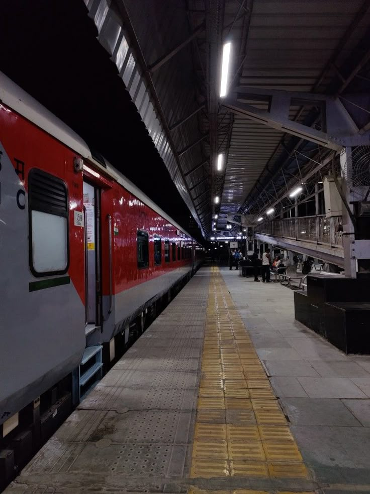
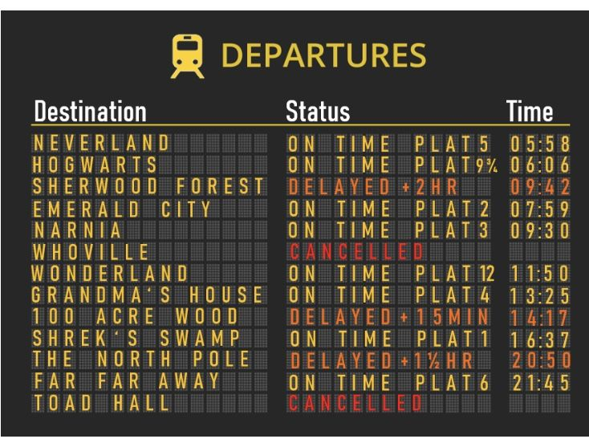

# 🚆 Train Ticket Dashboard

**Created by _Kaustav Roy Chowdhury_**

A fully functional dashboard built with **Streamlit**, **Seaborn**, and **MySQL**, designed to analyze and visualize Indian train ticket booking data. It allows users to **search train tickets** and explore **analytical insights** like booking trends, class distribution, top stations, and revenue generation.



---

## 🔧 Tech Stack

- **Backend**: MySQL
- **Frontend**: Streamlit
- **Visualization**: Seaborn, Matplotlib
- **Language**: Python

---

## 📁 Dataset

The dataset `train_ticket_dashboard.csv` contains synthetic records of train bookings with the following columns:

- `Train_No`
- `Train_Name`
- `Source_Station`
- `Destination_Station`
- `Class`
- `Price`
- `Seats_Available`
- `Travel_Date`

---

## 📦 Features

### 🔍 Ticket Checker

- Select source and destination station
- View matching tickets directly in a data table

### 📊 Analytics Dashboard

- **Class Distribution** (Pie Chart)
- **Top Boarding Stations** (Bar Chart)
- **Booking Trend Over Time** (Line Chart)
- **Revenue Generation by Date** (Line Chart)
- Identify **Peak Booking Day**

---

## 🚀 How to Run

### 1. Set up MySQL database

```sql
CREATE DATABASE train_ticket_dashboard;

-- Then import the CSV into a table named `train_tickets`
```

Use any MySQL GUI (like MySQL Workbench or phpMyAdmin) or Python to import `fixed_train_ticket_random_passengers.csv` into your database.

### 2. Install dependencies

```bash
pip install streamlit mysql-connector-python seaborn matplotlib
```

### 3. Run the Streamlit App

```bash
streamlit run app.py
```

---

## 🗂️ Project Structure

```
📁 train-ticket-dashboard/
├── app.py                     # Streamlit app
├── dbhelper_train_dashboard.py # DB connection & queries
├── train_ticket_dashboard.csv # Dataset
└── README.md
```

---

## 📷 Screenshots

### 🔍 Ticket Checker  


### 📊 Analytics  


---

## 📌 Future Enhancements

- Filter analytics by train class and date (SQL level)
- Booking success prediction (ML)
- Add interactive map of stations

---

## 🤝 Contributions

Feel free to fork this repo and add more features. Pull requests are welcome!

